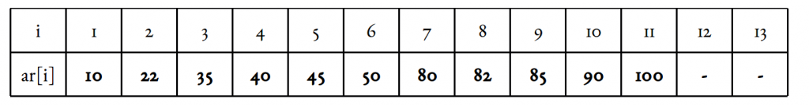
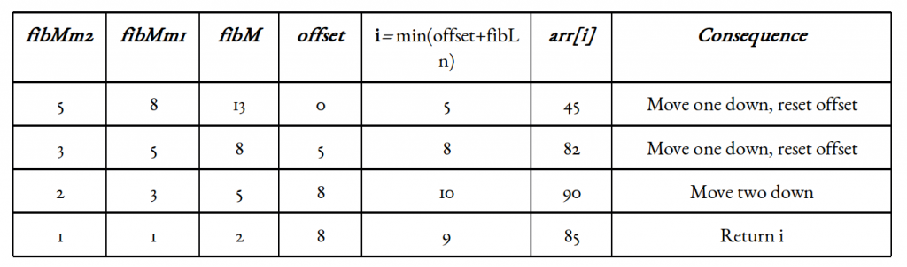

# Fibonacci Search

Given a sorted array arr[] of size n and an element x to be searched in it. Return index of x if it is present in array else return -1. 

Fibonacci Search is a comparison-based technique that uses Fibonacci numbers to search an element in a sorted array.
 

**Similarities with Binary Search:**

1. Works for sorted arrays
2. A Divide and Conquer Algorithm.
3. Has Log n time complexity.
 

**Differences with Binary Search:**

1. Fibonacci Search divides given array into unequal parts
2. Binary Search uses a division operator to divide range. Fibonacci Search doesn’t use /, but uses + and -. The division operator may be costly on some CPUs.
3. Fibonacci Search examines relatively closer elements in subsequent steps. So when the input array is big that cannot fit in CPU cache or even in RAM, Fibonacci Search can be useful.

**Background:**
 

Fibonacci Numbers are recursively defined as F(n) = F(n-1) + F(n-2), F(0) = 0, F(1) = 1. First few Fibonacci Numbers are 0, 1, 1, 2, 3, 5, 8, 13, 21, 34, 55, 89, 144, …

---

**Algorithm:**
 
Let the searched element be x.
 
The idea is to first find the smallest Fibonacci number that is greater than or equal to the length of the given array. Let the found Fibonacci number be fib (m’th Fibonacci number). We use (m-2)’th Fibonacci number as the index (If it is a valid index). Let (m-2)’th Fibonacci Number be i, we compare arr[i] with x, if x is same, we return i. Else if x is greater, we recur for subarray after i, else we recur for subarray before i.
 
Below is the complete algorithm
 
Let arr[0..n-1] be the input array and the element to be searched be x.  

1. Find the smallest Fibonacci Number greater than or equal to n. Let this number be fibM [m’th Fibonacci Number]. Let the two Fibonacci numbers preceding it be fibMm1 [(m-1)’th Fibonacci Number] and fibMm2 [(m-2)’th Fibonacci Number].
2. While the array has elements to be inspected: 
    1. Compare x with the last element of the range covered by fibMm2
    2. If x matches, return index
    3. Else If x is less than the element, move the three Fibonacci variables two Fibonacci down, indicating elimination of approximately rear two-third of the remaining array.
    4. Else x is greater than the element, move the three Fibonacci variables one Fibonacci down. Reset offset to index. Together these indicate the elimination of approximately front one-third of the remaining array.

     
3. Since there might be a single element remaining for comparison, check if fibMm1 is 1. If Yes, compare x with that remaining element. If match, return index.

---

**Illustration:**
 
Let us understand the algorithm with the below example:
 

Illustration assumption: 1-based indexing. Target element x is 85. Length of array n = 11.
Smallest Fibonacci number greate than or equal to 11 is 13. As per our illustration, fibMm2 = 5, fibMm1 = 8, and fibM = 13.
 
Another implementation detail is the offset variable (zero-initialized). It marks the range that has been eliminated, starting from the front. We will update it from time to time.
Now since the offset value is an index and all indices including it and below it have been eliminated, it only makes sense to add something to it. Since fibMm2 marks approximately one-third of our array, as well as the indices it marks, are sure to be valid ones, we can add fibMm2 to offset and check the element at index i = min(offset + fibMm2, n). 
 

---

**Complexity**
 

Worst case time complexity: **Θ(logn)**
 
Average case time complexity: **Θ(logn)**
 
Space complexity: **Θ(1)**

---

**Applications**
 
Key points about Fibonacci search are:

* Fibonacci Search examines closer elements in few steps. So when input array is big that cannot fit in CPU cache or in RAM, it is useful.
* On average, fibonacci search requires 4% more comparisons than binary search
* Fibonacci search requires only addition and subtraction whereas binary search requires bit-shift, division or multiplication operations.
* Fibonacci search can reduce the time needed to access an element in a random access memory.
* On magnetic tape where seek time depends on the current head position, there are two considerations: longer seek time and more comparisons that leads to prefer Fibonacci search