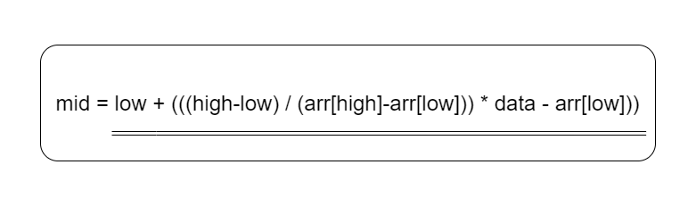

# Interpolation Search

Given a sorted array of n uniformly distributed values arr[], write a function to search for a particular element x in the array.
<br> 
Linear Search finds the element in O(n) time, <u>Jump Search</u> takes O(√ n) time and <u>Binary Search</u> takes O(log n) time.
<br>
The Interpolation Search is an improvement over Binary Search for instances, where the values in a sorted array are uniformly distributed. Interpolation constructs new data points within the range of a discrete set of known data points. Binary Search always goes to the middle element to check. On the other hand, interpolation search may go to different locations according to the value of the key being searched. For example, if the value of the key is closer to the last element, interpolation search is likely to start search toward the end side.

## How Does It Work?
---

<br>
To find the position to be searched, it uses the following formula.

<br>

> The idea of formula is to return higher value of pos<br>
> when element to be searched is closer to arr[hi]. And<br>
> smaller value when closer to arr[lo] 

<br>



<br>

> arr[] ==> Array where elements need to be searched<br>
> x     ==> Element to be searched<br>
> lo    ==> Starting index in arr[]<br>
> hi    ==> Ending index in arr[]

<br>

**The formula for pos can be derived as follows.**

```
Let's assume that the elements of the array are linearly distributed. 

General equation of line : y = m*x + c.
y is the value in the array and x is its index.

Now putting value of lo,hi and x in the equation
arr[hi] = m*hi+c ----(1)
arr[lo] = m*lo+c ----(2)
x = m*pos + c     ----(3)

m = (arr[hi] - arr[lo] )/ (hi - lo)

subtracting eqxn (2) from (3)
x - arr[lo] = m * (pos - lo)
lo + (x - arr[lo])/m = pos
pos = lo + (x - arr[lo]) *(hi - lo)/(arr[hi] - arr[lo])
```
---
<br>

**Algorithm**

The rest of the Interpolation algorithm is the same except for the above partition logic. <br>
**Step1:** In a loop, calculate the value of “pos” using the probe position formula. <br>
**Step2:** If it is a match, return the index of the item, and exit. <br>
**Step3:** If the item is less than arr[pos], calculate the probe position of the left sub-array. Otherwise, calculate the same in the right sub-array. <br>
**Step4:** Repeat until a match is found or the sub-array reduces to zero.

---

**Time Complexity:** 
* O(log2(log2 n)) for the <u>average case</u>
* O(n) for the <u>worst case</u> (when items are distributed exponentially)
<br>

**Space Complexity:** O(1)
<br>

##  When is it used?
---
Data set( array elements) is ordered & uniformly distributed.