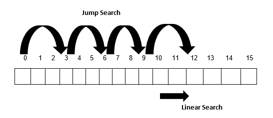

# Jump Search

Jump Search Algorithm is a relatively new algorithm for searching an element in a sorted array.

The fundamental idea behind this searching technique is to search fewer number of elements compared to linear search algorithm (which scans every element in the array to check if it matches with the element being searched or not). This can be done by skipping some fixed number of array elements or **jumping ahead by fixed number of steps** in every iteration.

 

## How Does It Work ?
---

Lets consider a sorted array A[] of size n, with indexing ranging between **0** and **n-1**, and element **x** that needs to be searched in the array A[]. For implementing this algorithm, a block of size **m** is also required, that can be skipped or jumped in every iteration. Thus, the algorithm works as follows:

* **Iteration 1:** if (x==A[0]), then success, else, if (x > A[0]), then jump to the next block.
* **Iteration 2:** if (x==A[m]), then success, else, if (x > A[m]), then jump to the next block.
* **Iteration 3:** if (x==A[2m]), then success, else, if (x > A[2m]), then jump to the next block.
* At any point in time, if (x < A[km]), then a linear search is performed from index A[(k-1)m] to A[km]

 

 

---

 

**Key Points to remember about Jump Search Algorithm**

* This algorithm works only for sorted input arrays
* Optimal size of the block to be skipped is √n, thus resulting in the time complexity O(√n2)
* The time complexity of this algorithm lies in between linear search (O(n)) and binary search (O(log n))
* Binary Search is better than Jump Search, but Jump Search has the advantage that we traverse back only once (Binary Search may require up to O(Log n) jumps, consider a situation where the element to be searched is the smallest element or just bigger than the smallest). So, in a system where binary search is costly, we use Jump Search.
* It is also called block search algorithm

 

---

 

**Advantages of Jump Search Algorithm**

* It is faster than the linear search technique which has a time complexity of O(n) for searching an element

**Disadvantages of Jump Search Algorithm**

* It is slower than binary search algorithm which searches an element in O(log n)
* It requires the input array to be sorted

 

---

 

**Time Complexity :** O(√n)

**Auxiliary Space :** O(1)