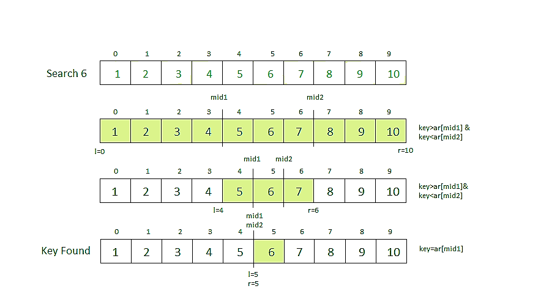

# Ternary Search

**Ternary search** is a <u>decrease(by constant) and conquer</u> algorithm that can be used to find an element in an array. It is similar to <u>binary search</u> where we divide the array into two parts but in this algorithm, we divide the given array into three parts and determine which has the key (searched element). We can divide the array into three parts by taking mid1 and mid2 which can be calculated as shown below. Initially, l and r will be equal to 0 and n-1 respectively, where n is the length of the array. 

It is same as the binary search. The only difference is that, it reduces the time complexity a bit more. Its time complexity is O(log n base 3) and that of binary search is O(log n base 2).

```
mid1 = l + (r-l)/3 
mid2 = r – (r-l)/3 
```
>**Note:** Array needs to be sorted to perform ternary search on it.

<br>

## How Does It Work ?
---

<br>

**Steps to perform Ternary Search:**

1. First, we compare the key with the element at mid1. If found equal, we return mid1.
2. If not, then we compare the key with the element at mid2. If found equal, we return mid2.
3. If not, then we check whether the key is less than the element at mid1. If yes, then recur to the first part.
4. If not, then we check whether the key is greater than the element at mid2. If yes, then recur to the third part.
5. If not, then we recur to the second (middle) part.

<br>

---

<br>

**Example:**



---

<br>

>For Iterative Method:

* **Time Complexity: O(log3n)**
* **Auxiliary Space: O(1)**

>For Recursive Method: 

* **Time Complexity: O(log3n)**
* **Auxiliary Space: O(log3n)**

<br>

---

<br>

**Binary search Vs Ternary Search**

The time complexity of the binary search is more than  the ternary search but it does not mean that ternary search is better. In reality, the number of comparisons in ternary search much more which makes it slower than binary search.