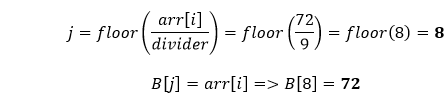

# Bucket Sort

**Bucket sort** or **bin sort** is a sorting algorithm that works by distributing the elements into a number of buckets, homogenously. Each bucket is then sorted individually. In order to sort the bucket, we use the sort() method of the Arrays class. It is usually used to <u>sort floating-point numbers</u>.

 
 

## How Does Bucket Sort Works?

 

<pre>
<b>arr[]=22, 45, 12, 8, 10, 6, 72, 81, 33, 18, 50, 14</b>

Total number of elements in the given array (N) = 12

Max element in array = 81

Min element in array = 6

We need <b>10</b> buckets to sort the array. Suppose, these 10 buckets are represented as <b>B</b>s. After that, we need to find a divider that will be used to put the elements in the bucket. In order to determine the divider, we use the following formula:

Let's put the values in the above formula, we get:

Hence, bucket = 10, divider = 9

Let's put the element arr[i] in the correct bucket, we will use the following formula:

Let's see how it works by putting elements in the buckets. We will start from the first index.

<b>For i=0:</b>

We will insert the <b>zeroth</b> element <b>(22)</b> in the <b>2nd</b> bucket and increment the array index (i) by 1.

<b>For i=1:</b>

We will insert the <b>first</b> element <b>(45)</b> in the <b>5th</b> bucket and increment the array index (i) by 1.

<b>For i=2:</b>

We will insert the <b>second</b> element <b>(12)</b> in the <b>1st</b> bucket and increment the array index (i) by 1.

<b>For i=3:</b>

We will insert the <b>third</b> element <b>(8)</b> in the <b>0th</b> bucket and increment the array index (i) by 1.

<b>For i=4:</b>

We will insert the <b>fourth</b> element <b>(10)</b> in the <b>1st</b> bucket and increment the array index (i) by 1.

<b>For i=5:</b>

We will insert the <b>fifth<b> element <b>(6)</b> in the <b>0th</b> bucket and increment the array index (i) by 1.

<b>For i=6:</b>

We will insert the <b>sixth</b> element <b>(72)</b> in the <b>8th</b> bucket and increment the array index (i) by 1.

<b>For i=7:</b>

We will insert the <b>seventh</b> elements <b>(81)</b> in the <b>8th</b> bucket and increment the array index (i) by 1.

<b>For i=8:</b>

We will insert the <b>eighth</b> element <b>(33)</b> in the <b>3rd</b> bucket and increment the array index (i) by 1.

<b>For i=9:</b>

We will insert the <b>ninth</b> elements <b>(18)</b> in the <b>2nd</b> bucket and increment the array index (i) by 1.

<b>For i=10:</b>

We will insert the <b>tenth</b> elements <b>(50)</b> in the <b>5th</b> bucket and increment the array index (i) by 1.

<b>For i=11:</b>

We will insert the <b>eleventh</b> elements <b>(14)</b> in the <b>1st</b> bucket and increment the array index (i) by 1.

Now, will perform <b>insertion</b> sort on the individual buckets to sort the elements. Let's start from the first bucket (<b>0th</b>).

Is ? Yes, swap their positions.

Now, move to the next bucket (<b>1st</b>) and compare each element to the other.

Is ? Yes, swap their positions and compare the next pair. Is ? No, elements are already in a sorted manner, so we will not swap their positions.

Now, move to the next bucket (<b>2nd</b>) and compare their elements.

Is ? Yes, swap their positions.

Now, we will move to the next bucket. Here, a point to note that the bucket that has only one element is already sorted and the bucket that has no element, we will skip them. Therefore, we will move to the <b>fifth</b> bucket and compare their elements.

Is ? No, elements are already sorted. Similarly, trace the buckets until we reach the last bucket. So, we will stop here as we have got a sorted array.

At last, we will take out all the elements from each bucket. Therefore, we get a sorted array.

We have understood the logic of the bucket sort. Let's implement the logic in a Java program and perform bucket sorting over an array.
</pre>

 
 

---

 

**Advantages of Bucket Sort**

* It is asymptotically fast because of uniform distribution.
* It reduces the number of comparisons.
* It is fast in comparison to bubble sort.

 

**Disadvantages of Bucket Sort**

* It is not an in-place sorting because we need some extra space to sort the buckets.
* It may or may not be the stable sorting algorithm.
* It is not useful if we have large array because it increases the cost.

 
 

---

 

* **Time Complexity**
    * Best: O(n+k)
    * Worst: O(n2)
    * Avarage: O(n)
* **Time Complexity:** O(n+k)

 
 

---

 

**Is the Bucket Sort algorithm stable?**

>Bucket sort is not a stable sorting algorithm. If you remember,  A sorting algorithm is said to be stable if two objects with equal keys appear in the same order in sorted output as they appear in the input array to be sorted.

 
 

---

 

**Bucket Sort Applications**
 
Bucket sort is used when:

* Input is uniformly distributed over a range.
* There are floating point values