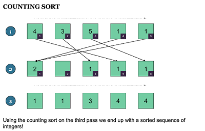

# Counting Sort

The Counting sort algorithm, like `Radix sort` and `Bucket sort`, is an integer-based algorithm (i.e. the values of the input array are assumed to be integers), non-comparison, and linear sorting algorithm. Hence counting sort is among the fastest sorting algorithms around, in theory. It is also one of the few *linear sorting algorithms* or *O(n) sorting algorithms*.

 

## How does the counting sort algorithm works?

---

 

Well, counting sort creates a bucket for each value and keeps a counter in each bucket. Then each time a value is encountered in the input collection,  the appropriate counter is incremented.

Because the Counting sort algorithm creates a bucket for each value, an imposing restriction is that the maximum value in the input array is known beforehand. Once every value is inserted into the bucket, you just go through the `count array` and print them up depending upon their frequency.

 

---

 

## How to implement Counting Sorting in Java?

**You can follow the below steps to implement the counting sort algorithm**

1. Since the values range from 0 to k, create k+1  buckets. For example, if your array contains 0 to 10 then create 11 buckets for storing the frequency of each number. This array is also called a frequency array or count array.

2. To fill the buckets, iterate through the input array, and each time a value appears, increment the counter in its bucket.

3. Now fill the input array with the compressed data in the buckets. Each bucket's key represents a value in the array. So for each bucket, from smallest key to largest, add the index of the bucket to the input array and decrease the counter in the said bucket by one; until the counter is zero.

 

 

---

## How does counting sort works?

As I said before, it first creates a count or frequency array, where each index represents the value in the input array. Hence you need a count array of k+1 to sort values in the range 0 to k, where k is the maximum value in the array. So, in order to sort an array of 1 to 100, you need an array of size 101.

After creating a count array or frequency array you just go through the input array and increment counter in the respective index, which serves as a key.

For example, if 23 appears 3 times in the input array then index 23 will contain 3. Once you create a frequency array, just go through it and print the number as many times as they appear in the count array. You are done, the integer array is sorted now.

 

---

 

**When do you use the counting sort algorithm?**

In practice, we usually use the counting sort algorithm when having k = O(n), in which case the running time is O(n).

 

---

 

**Is counting sort a stable algorithm?**

Yes, The counting sort is a stable sort like multiple keys with the same value are placed in the sorted array in the same order that they appear in the original input array.

 

---

 

**Time complexity:** O(N+K)

**Space Complexity:** O(K)