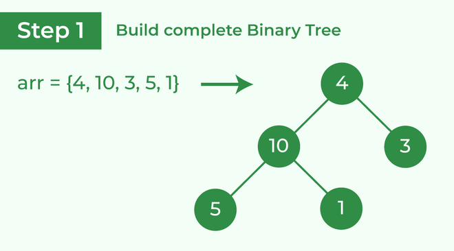
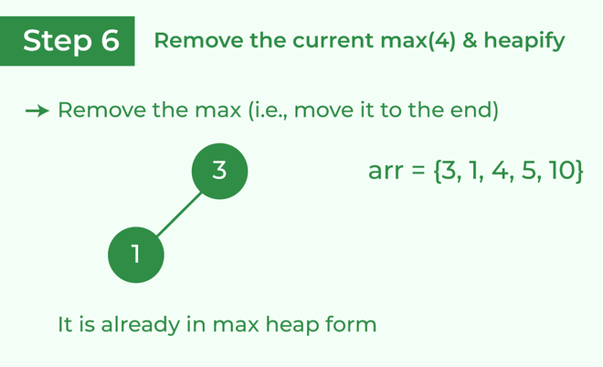

# Heap Sort

<pre>
<i><b>Heap sort</b> is a comparison-based sorting technique based on <u>Binary Heap</u> data structure. It is similar 
to the <u>selection sort</u> where we first find the minimum element and place the minimum element at the beginning.
 Repeat the same process for the remaining elements.</i>
</pre>

* Heap sort is an in-place algorithm.
* I t is a complete binary tree
* Its typical implementation is not stable, but can be made stable
* Typically 2-3 times slower than well-implemented QuickSort.  The reason for slowness is a lack of locality of reference.

 
 

## How does Heap Sort Work?

 

* Build a max heap from the input data. 
* At this point, the maximum element is stored at the root of the heap. Replace it with the last item of the heap followed by reducing the size of the heap by 1. Finally, heapify the root of the tree. 
* Repeat step 2 while the size of the heap is greater than 1.

<b>Note:</b> The heapify procedure can only be applied to a node if its children nodes are heapified. So the heapification must be performed in the bottom-up order.

 

**How does Heapify work?**

Array = {1, 3, 5, 4, 6, 13, 10, 9, 8, 15, 17}

Corresponding Complete Binary Tree is:
<pre>
                 1
              /     \
           3         5
        /    \     /  \
      4      6   13  10
     / \    / \
   9   8  15 17
</pre>

 

<b>The task to build a Max-Heap from above array.</b>

Total Nodes = 11.

Total non-leaf nodes= (11/2)-1=5

last non-leaf node = 6.

Therefore, Last Non-leaf node index = 4.

To build the heap, heapify only the nodes: [1, 3, 5, 4, 6] in reverse order.

 

<b>Heapify 6:</b> Swap 6 and 17.

<pre>
                 1
              /     \
           3         5
        /    \      /  \
     4      17   13  10
    / \    /  \
  9   8  15   6
</pre>

 

<b>Heapify 4:</b> Swap 4 and 9.

<pre>
                 1
              /     \
           3         5
        /    \      /  \
     9      17   13  10
    / \    /  \
  4   8  15   6
</pre>

 

<b>Heapify 5:</b> Swap 13 and 5.

<pre>
                 1
              /     \
           3         13
        /    \      /  \
     9      17   5   10
    / \    /  \
 4   8  15   6
</pre>

 

<b>Heapify 3:</b> First Swap 3 and 17, again swap 3 and 15.

<pre>
                 1
             /     \
        17         13
       /    \      /  \
    9      15   5   10
   / \    /  \
 4   8  3   6
</pre>

 

<b>Heapify 1:</b> First Swap 1 and 17, again swap 1 and 15, finally swap 1 and 6.

<pre>
                 17
              /      \
          15         13
         /    \      /  \
       9      6    5   10
      / \    /  \
    4   8  3    1
</pre>

 

**Detailed Working of Heap Sort**

<pre>
<i>To understand heap sort more clearly, let’s take an unsorted array and try to sort it using heap sort.
Consider the array: arr[] = {4, 10, 3, 5, 1}.
<b>Build Complete Binary Tree:</b> Build a complete binary tree from the array.</i>

<i>
<b>Transform into max heap:</b> After that, the task is to construct a tree from that unsorted array and try to convert it into <u>max heap.</u>

<ul><li>To transform a heap into a max-heap, the parent node should always be greater than or equal to the child nodes
<ul><li>Here, in this example, as the parent node 4 is smaller than the child node <b>10</b>, thus, swap them to build a max-heap.</li></li></ul></ul>

Transform it into a max heap image widget

Now, as seen, <b>4</b> as a parent is smaller than the child <b>5</b>, thus swap both of these again and the resulted heap and array should be like this:
</i>

<i>
<b>Perform heap sort:</b> Remove the maximum element in each step (i.e., move it to the end position and remove that) and then consider the remaining elements and transform it into a max heap.

<ul><li>Delete the root element <b>(10)</b> from the max heap. In order to delete this node, try to swap it with the last node, i.e. <b>(1)</b>. After removing the root element, again heapify it to convert it into max heap.
<ul><li>Resulted heap and array should look like this:</li></li></ul></ul>
</i>

<li><i>Repeat the above steps and it will look like the following:</i>

<li><i>Now remove the root (i.e. 3) again and perform heapify.</i>

<li><i>Now when the root is removed once again it is sorted. and the sorted array will be like <b>arr[] = {1, 3, 4, 5, 10}</b>.</i>

</pre>

 
 

---

 

**Advantages of Heap Sort**

* **Efficiency –**  The time required to perform Heap sort increases logarithmically while other algorithms may grow exponentially slower as the number of items to sort increases. This sorting algorithm is very efficient.
* **Memory Usage –** Memory usage is minimal because apart from what is necessary to hold the initial list of items to be sorted, it needs no additional memory space to work
* **Simplicity –**  It is simpler to understand than other equally efficient sorting algorithms because it does not use advanced computer science concepts such as recursion.

 

**Disadvantages of Heap Sort**

* **Costly**: Heap sort is costly.
* **Unstable**: Heat sort is unstable. It might rearrange the relative order.
* **Efficient**: Heap Sort are not very efficient when working with highly complex data. 

 
 

---

 

* **Time Complexity:** O(N log N)
* **Space Complexity:** O(1)

 

---

 

**Is the Bubble sort algorithm stable?**

>Heap sort algorithm is not a stable algorithm. This algorithm is not stable because the operations that are performed in a heap can change the relative ordering of the equivalent keys.

 
 

---

 

**Applications of HeapSort:**

* Systems concerned with security and embedded systems such as Linux Kernel use Heap Sort because of the O(n log n) upper bound on Heapsort's running time and constant O(1) upper bound on its auxiliary storage.
* Heapsort is mainly used in hybrid algorithms like the <u>IntroSort</u>.
* <u>Sort a nearly sorted (or K sorted) array</u>
* <u>k largest(or smallest) elements in an array</u>