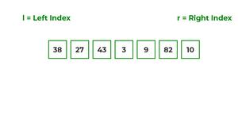

# Merge Sort

<b>Merge sort</b> is a sorting algorithm that works by dividing an array into smaller subarrays, sorting each subarray, and then merging the sorted subarrays back together to form the final sorted array.

Merge sort is a popular choice for sorting large datasets because it is relatively efficient and easy to implement. It is often used in conjunction with other algorithms, such as quicksort, to improve the overall performance of a sorting routine.

 
 

## How does Bubble Sort Work?

 

In simple terms, we can say that the process of merge sort is to divide the array into two halves, sort each half, and then merge the sorted halves back together. This process is repeated until the entire array is sorted.

Think of it as a recursive algorithm continuously splits the array in half until it cannot be further divided. This means that if the array becomes empty or has only one element left, the dividing will stop, i.e. it is the base case to stop the recursion. If the array has multiple elements, split the array into halves and recursively invoke the merge sort on each of the halves. Finally, when both halves are sorted, the merge operation is applied. Merge operation is the process of taking two smaller sorted arrays and combining them to eventually make a larger one.

 
 

**Pseudo Code**

 

<pre>
step 1: start

step 2: declare array and left, right, mid variable

step 3: perform merge function.
    if left > right
        return
    mid= (left+right)/2
    mergesort(array, left, mid)
    mergesort(array, mid+1, right)
    merge(array, left, mid, right)

step 4: Stop
</pre>

To know the functioning of merge sort, lets consider an array arr[] = {38, 27, 43, 3, 9, 82, 10}

<i>
<pre>
<li>At first, check if the left index of array is less than the right index, if yes then calculate its mid point

    

<li>Now, as we already know that merge sort first divides the whole array iteratively into equal halves, unless the atomic values are achieved. 
<li>Here, we see that an array of 7 items is divided into two arrays of size 4 and 3 respectively.

    

<li>Now, again find that is left index is less than the right index for both arrays, if found yes, then again calculate mid points for both the arrays.

    

<li>Now, further divide these two arrays into further halves, until the atomic units of the array is reached and further division is not possible.

    

<li>After dividing the array into smallest units, start merging the elements again based on comparison of size of elements
<li>Firstly, compare the element for each list and then combine them into another list in a sorted manner.

    

<li>After the final merging, the list looks like this:

    

</pre>
</i>

 
 

---

 

**Advantages of Merge Sort**

* Merge sort has a time complexity of O(n log n), which means it is relatively efficient for sorting large datasets.
* Merge sort is a stable sort, which means that the order of elements with equal values is preserved during the sort.
* It is easy to implement thus making it a good choice for many applications.
* It is useful for external sorting. This is because merge sort can handle large datasets, it is often used for external sorting, where the data being sorted does not fit in memory.
* The merge sort algorithm can be easily parallelized, which means it can take advantage of multiple processors or cores to sort the data more quickly.
* Merge sort requires relatively few additional resources (such as memory) to perform the sort. This makes it a good choice for systems with limited resources.

 

**Disadvantages of Merge Sort**

* Slower comparative to the other sort algorithms for smaller tasks.
* Goes through the whole process even i he list is sorted (just like insertion and bubble sort?)
* Uses more memory space to store the sub elements of the initial split list.

 
 

---

 

* **Time Complexity:** O(n log(n))
* **Auxiliary Space:** O(n)

 
 

---

 

**Is Merge sort Stable?**

>Yes, merge sort is stable. 

 
 

---

 

**Merge Sort Applications**
<li>Inversion count problem
<li>External sorting
<li>E-commerce applications
