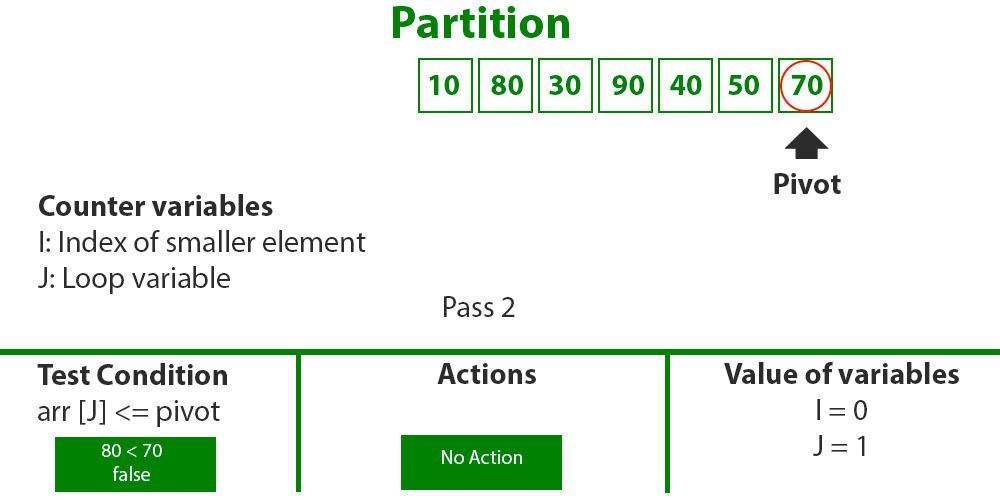
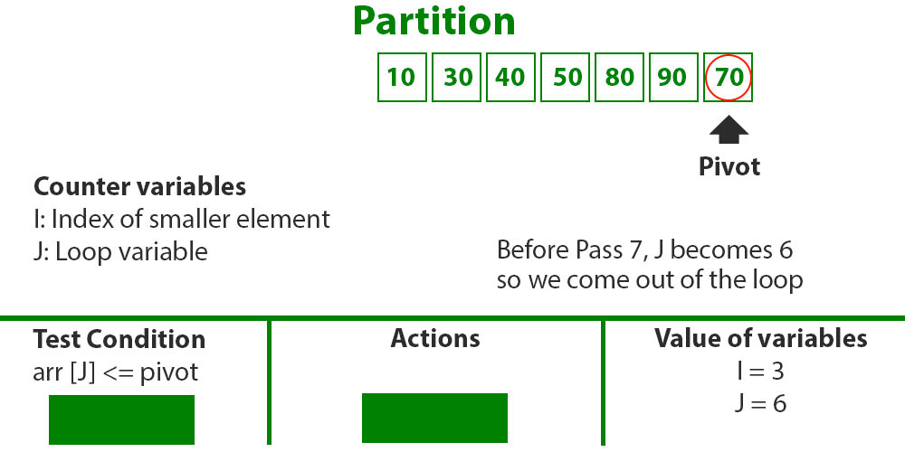
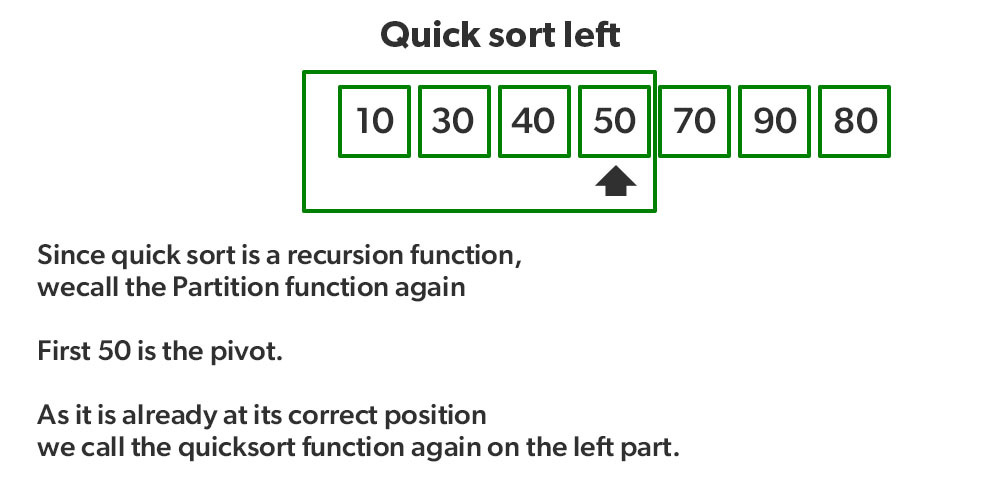

# Quick Sort

Like <u>Merge Sort</u>, QuickSort is a <u>Divide and Conquer</u> algorithm. It picks an element as a pivot and partitions the given array around the picked pivot. There are many different versions of quickSort that pick pivot in different ways. 

* Always pick the first element as a pivot.
* Always pick the last element as a pivot (implemented below)
* Pick a random element as a pivot.
* Pick median as the pivot.

The key process in **quickSort** is a partition(). The target of partitions is, given an array and an element x of an array as the pivot, put x at its correct position in a sorted array and put all smaller elements (smaller than x) before x, and put all greater elements (greater than x) after x. All this should be done in linear time.

 
 

## How does Quick Sort Work?

 

There can be many ways to do partition, following pseudo-code adopts the method given in the CLRS book. The logic is simple, we start from the leftmost element and keep track of the index of smaller (or equal to) elements as i. While traversing, if we find a smaller element, we swap the current element with arr[i]. Otherwise, we ignore the current element. 

 

**Pseudo Code for recursive QuickSort function:**

<pre>
quickSort(arr[], low, high) {

    if (low < high) {

        /* pi is partitioning index, arr[pi] is now at right place */

        pi = partition(arr, low, high);

        quickSort(arr, low, pi – 1);  // Before pi

        quickSort(arr, pi + 1, high); // After pi

    }

}
</pre>

 

**Pseudo code for partition()**

<pre>
/* This function takes last element as pivot, places the pivot element at its correct position in sorted array, and places all smaller (smaller than pivot) to left of pivot and all greater elements to right of pivot */

partition (arr[], low, high)
{
    // pivot (Element to be placed at right position)
    pivot = arr[high];  

    i = (low – 1)  // Index of smaller element and indicates the 
    // right position of pivot found so far

    for (j = low; j <= high- 1; j++){

        // If current element is smaller than the pivot
        if (arr[j] < pivot){
            i++;    // increment index of smaller element
            swap arr[i] and arr[j]
        }
    }
    swap arr[i + 1] and arr[high])
    return (i + 1)
}
</pre>

 

**Illustration of partition():**

<i>
<pre>
Consider: arr[] = {10, 80, 30, 90, 40, 50, 70}
<ul>
    <li>Indexes:  0   1   2   3   4   5   6 
    <li>low = 0, high =  6, pivot = arr[h] = 70
    <li>Initialize index of smaller element, i = -1
</ul>

    

<ul>
    <li>Traverse elements from j = low to high-1
    <ul>
        <li><b>j = 0</b>: Since arr[j] <= pivot, do i++ and swap(arr[i], arr[j])
        <li><b>i = 0</b>
    </ul>
    <li>arr[] = {10, 80, 30, 90, 40, 50, 70} // No change as i and j are same
    <li><b>j = 1</b>: Since arr[j] > pivot, do nothing
</ul>

    

<ul>
    <li><b>j = 2</b> : Since arr[j] <= pivot, do i++ and swap(arr[i], arr[j])
    <li><b>i = 1</b>
    <li>arr[] = {10, 30, 80, 90, 40, 50, 70} // We swap 80 and 30 
</ul>

    

<ul>
    <li><b>j = 3</b> : Since arr[j] > pivot, do nothing // No change in i and arr[]
    <li><b>j = 4</b> : Since arr[j] <= pivot, do i++ and swap(arr[i], arr[j])
    <li><b>i = 2</b>
    <li>arr[] = {10, 30, 40, 90, 80, 50, 70} // 80 and 40 Swapped
</ul>

    

<ul>
    <li><b>j = 5</b> : Since arr[j] <= pivot, do i++ and swap arr[i] with arr[j] 
    <li><b>i = 3</b> 
    <li>arr[] = {10, 30, 40, 50, 80, 90, 70} // 90 and 50 Swapped 
</ul>

    

<ul>
    <li>We come out of loop because j is now equal to high-1.
    <li><b>Finally we place pivot at correct position by swapping arr[i+1] and arr[high] (or pivot)</b>
    <li>arr[] = {10, 30, 40, 50, 70, 90, 80} // 80 and 70 Swapped 
</ul>

    

<ul>
    <li>Now 70 is at its correct place. All elements smaller than 70 are before it and all elements greater than 70 are after it.
    <li>Since quick sort is a recursive function, we call the partition function again at left and right partitions
</ul>

    

<ul>
    <li>Again call function at right part and swap 80 and 90
</ul>

    

</pre>
</i>

 
 

---

 

**Advantages of Quick Sort**

 

* It is a divide-and-conquer algorithm that makes it easier to solve problems.
* It is efficient on large data sets.
* It is a stable sort, meaning that if two elements have the same key, their relative order will be preserved in the sorted output.
* It has a low overhead, as it only requires a small amount of memory to function.

 

**Disadvantages of Java Bubble Sort**

* It has a worst-case time complexity of O(n^2), which occurs when the pivot is chosen poorly.
* It is not a good choice for small data sets.
* It can be sensitive to the choice of pivot.
* It is not cache-efficient.

 
 

---

**Time Complexity:**
* Best Case: 	O(n*logn)
* Avarage Case: O(n*logn)
* Worst Case:   	O(n2)

**Space Complexity:** O(n*logn)

 
 

---

 

**Is the Quick algorithm stable?**

>The default implementation is not stable. However any sorting algorithm can be made stable by considering indexes as comparison parameter. 

 
 

---

 

**Applications:**

* Commercial Computing is used in various government and private organizations for the purpose of sorting various data like sorting files by name/date/price, sorting of students by their roll no., sorting of account profile by given id, etc.
* The sorting algorithm is used for information searching and as Quicksort is the fastest algorithm so it is widely used as a better way of searching.
* It is used everywhere where a stable sort is not needed.
* Quicksort is a cache-friendly algorithm as it has a good locality of reference when used for arrays.
* It is tail -recursive and hence all the call optimization can be done.
* It is an in-place sort that does not require any extra storage memory.
* It is used in operational research and event-driven simulation.
* Numerical computations and in scientific research, for accuracy in calculations most of the efficiently developed algorithm uses priority queue and quick sort is used for sorting.
* Variants of Quicksort are used to separate the Kth smallest or largest elements.
* It is used to implement primitive type methods.
* If data is sorted then the search for information became easy and efficient.