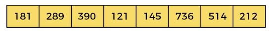
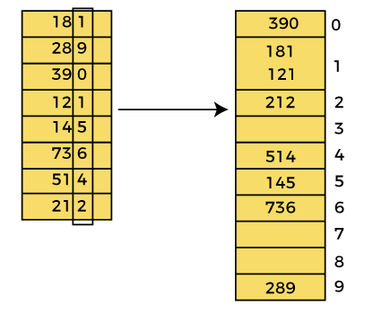
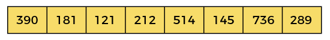
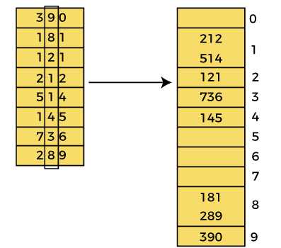
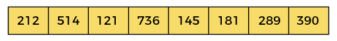
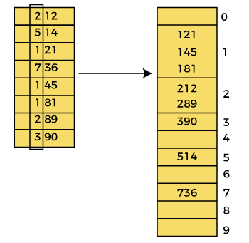
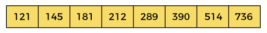

# Radix Sort

Radix sort is a sorting algorithm that sorts numbers based on the positions of their digits. Basically, it uses the place value of the digits in a number. **Unlike most of the other sorting algorithms, such as Merge Sort, Insertion Sort, Bubble Sort, it doesn't compare the numbers.**

Radix sort uses a stable sorting algorithm as a subroutine to sort the digits. We've used a variation of counting sort as a subroutine here that uses the radix to sort the digits in every position. Counting sort is a stable sorting algorithm and it works well in practice.

Radix sort works by sorting digits from the Least Significant Digit (LSD) to the Most Significant Digit (MSD). We can also implement Radix sort to process digits from MSD.

 
 

## How Does Radix Sort Work?

 

**Pseudo Code**
<pre>
radixSort(arr)  
max = largest element in the given array  
d = number of digits in the largest element (or, max)  
Now, create d buckets of size 0 - 9  
for i -> 0 to d  
sort the array elements using counting sort (or any stable sort) according to the digits at  
the ith place  
</pre>

 

Now, let's see the working of Radix sort Algorithm.

The steps used in the sorting of radix sort are listed as follows -

* First, we have to find the largest element (suppose **max**) from the given array. Suppose **'x'** be the number of digits in **max**. The **'x'** is calculated because we need to go through the significant places of all elements.
* After that, go through one by one each significant place. Here, we have to use any stable sorting algorithm to sort the digits of each significant place.

Now let's see the working of radix sort in detail by using an example. To understand it more clearly, let's take an unsorted array and try to sort it using radix sort. It will make the explanation clearer and easier.

 

 

In the given array, the largest element is **736** that have **3** digits in it. So, the loop will run up to three times (i.e., to the **hundreds place**). That means three passes are required to sort the array.

Now, first sort the elements on the basis of unit place digits (i.e., **x = 0**). Here, we are using the counting sort algorithm to sort the elements.

 
 

**Pass 1:**

In the first pass, the list is sorted on the basis of the digits at 0's place.

 

 

After the first pass, the array elements are -

 

 
 

**Pass 2:**

In this pass, the list is sorted on the basis of the next significant digits (i.e., digits at 10th place).

 

 

After the second pass, the array elements are -

 

 
 

**Pass 3:**

In this pass, the list is sorted on the basis of the next significant digits (i.e., digits at 100th place).

 

 

After the third pass, the array elements are -

 

 

Now, the array is sorted in ascending order.

 
 

---

 

**Advantages of Radix Sort:**

* Radix sort has a linear time complexity, which makes it faster than comparison-based sorting algorithms such as quicksort and merge sort for large data sets.
* It is a stable sorting algorithm, meaning that elements with the same key value maintain their relative order in the sorted output.
* Radix sort is efficient for sorting large numbers of integers or strings.
* It can be easily parallelized.

 

**Disadvantages of Radix Sort:**

* Radix sort is not efficient for sorting floating-point numbers or other types of data that cannot be easily mapped to a small number of digits.
* It requires a significant amount of memory to hold the count of the number of times each digit value appears.
* It is not efficient for small data sets or data sets with a small number of unique keys.
* It requires that the data being sorted can be represented in a fixed number of digits, which may not be the case for some types of data.

 
 

---

 

* **Time Complexity:** 
    * Best Case: Ω(n+k)
    * Average Case: θ(nk)
    * Worst Case: O(nk)
* **Space Complexity:** O(n + k)

 
 

---

 

**Is the Radix sort algorithm stable?**

>Yes, the radix sort algorithm is stable.

 
 

---

 

**Applications**

* In a typical computer, which is a sequential random-access machine, where the records are keyed by multiple fields radix sort is used. For eg., you want to sort on three keys month, day and year. You could compare two records on year, then on a tie on month and finally on the date. Alternatively, sorting the data three times using Radix sort first on the date, then on month, and finally on year could be used.
* It was used in card sorting machines with 80 columns, and in each column, the machine could punch a hole only in 12 places. The sorter was then programmed to sort the cards, depending upon which place the card had been punched. This was then used by the operator to collect the cards which had the 1st row punched, followed by the 2nd row, and so on.
* DC3 algorithm (Kärkkäinen-Sanders-Burkhardt) while making a suffix array.
* Places where there are numbers in large ranges.