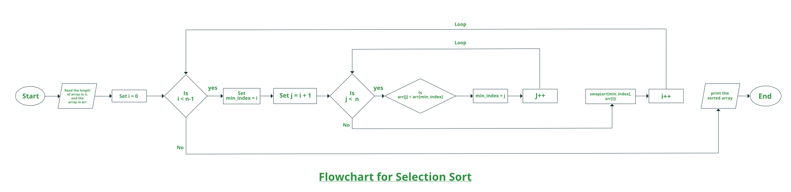

# Selection Sort

**Selection sort** is a simple and efficient sorting algorithm that works by repeatedly selecting the smallest (or largest) element from the unsorted portion of the list and moving it to the sorted portion of the list. The algorithm repeatedly selects the smallest (or largest) element from the unsorted portion of the list and swaps it with the first element of the unsorted portion. This process is repeated for the remaining unsorted portion of the list until the entire list is sorted. One variation of selection sort is called “Bidirectional selection sort” that goes through the list of elements by alternating between the smallest and largest element, this way the algorithm can be faster in some cases.

The algorithm maintains two subarrays in a given array.

* The subarray which already sorted. 
* The remaining subarray was unsorted.

In every iteration of the selection sort, the minimum element (considering ascending order) from the unsorted subarray is picked and moved to the beginning of unsorted subarray. 

After every iteration sorted subarray size increase by one and unsorted subarray size decrease by one.

After N (size of array) iteration we will get sorted array.

 
 

---

 

## How Does Selection Sort Work?

 

<pre>
Lets consider the following array as an example: <b>arr[] = {64, 25, 12, 22, 11}</b>

<b>First Pass:</b>

<li>For the first position in the sorted array, the whole array is traversed from index 0 to 4 sequentially. The first position where <b>64</b> is stored presently, after traversing whole array it is clear that <b>11</b> is the lowest value.

<pre><b>64</b>   25   12   22   11</pre>

<li>Thus, replace 64 with 11. After one iteration <b>11</b>, which happens to be the least value in the array, tends to appear in the first position of the sorted list.

<pre><b>11</b>  25   12   22   64</pre>

<b>Second Pass:</b>

<li>For the second position, where 25 is present, again traverse the rest of the array in a sequential manner.

<pre>11   <b>25</b>   12   22   64</pre>

<li>After traversing, we found that <b>12</b> is the second lowest value in the array and it should appear at the second place in the array, thus swap these values.

<pre>11   <b>12</b>   25   22   64</pre>

<b>Third Pass:</b>

Now, for third place, where <b>25</b> is present again traverse the rest of the array and find the third least value present in the array.

<pre>11   12   <b>25</b>   22   64</pre>

<li>While traversing, <b>22</b> came out to be the third least value and it should appear at the third place in the array, thus swap <b>22</b> with element present at third position.

<pre>11   12   <b>22</b>   25   64</pre>

<b>Fourth pass:</b>

<li>Similarly, for fourth position traverse the rest of the array and find the fourth least element in the array 
<li>As <b>25</b> is the 4th lowest value hence, it will place at the fourth position.

<pre>11   12   22   <b>25</b>   64</pre>

<b>Fifth Pass:</b>

<li>At last the largest value present in the array automatically get placed at the last position in the array
<li>The resulted array is the sorted array.

</pre>

 
 

---

 

**Advantages of Selection Sort**

* Simple and easy to understand.
* Preserves the relative order of items with equal keys which means it is stable.
* Works well with small datasets.
* It is adaptable to various types of data types.
* Selection sort is an in-place sorting algorithm, which means it does not require any additional memory to sort the list.

 

**Disadvantages of Selection Sort**

* Selection sort has a time complexity of O(n2) in the worst and average case.
* Does not works well on large datasets.
* Selection sort algorithm needs to iterate over the list multiple times, thus it can lead to an unbalanced branch.
* Selection sort has poor cache performance and hence it is not cache friendly. 
* Not adaptive, meaning it doesn’t take advantage of the fact that the list may already be sorted or partially sorted
* Not a good choice for large data sets with slow random access memory (RAM)
* It’s not a comparison sort and doesn’t have any performance guarantees like merge sort or quick sort.
* It has poor cache performance
* It can cause poor branch prediction due to its high branch misprediction rate
* It has a high number of write operations, leading to poor performance on systems with slow storage.
* It is not a parallelizable algorithm, meaning that it cannot be easily split up to be run on multiple processors or cores.
* It does not handle data with many duplicates well, as it makes many unnecessary swaps.
* It can be outperformed by other algorithms such as quicksort and heapsort in most cases. 

 
 

---

 

* **Time Complexity:**
    * Best: O(n2)
    * Worst: O(n2)
    * Average: O(n2)
* **Auxiliary Space:** O(1)

 
 

---

 

**Is the Selection Sort algorithm stable?**

>The default implementation is not stable. However, it can be made stable.

 
 

---

 

**Selection Sort Applications**

The selection sort is used when

* a small list is to be sorted
* cost of swapping does not matter
* checking of all the elements is compulsory
* cost of writing to a memory matters like in flash memory (number of * writes/swaps is O(n) as compared to O(n2) of bubble sort)