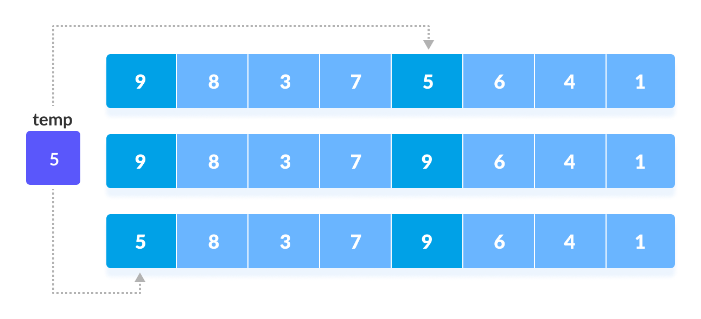
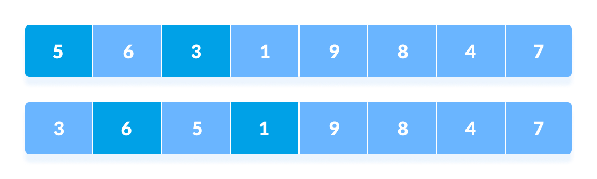
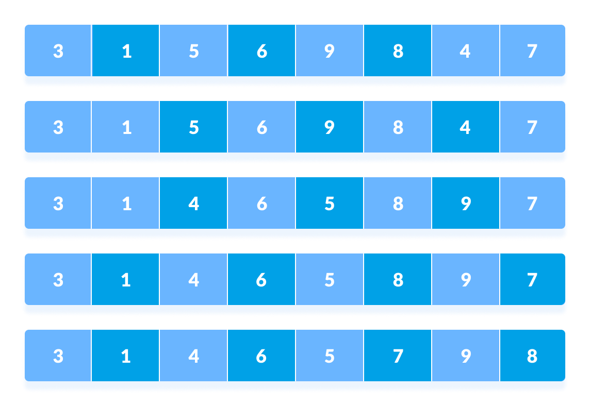

# Shell Sort

Shell sort is a generalized version of the <u>insertion sort</u> algorithm. It first sorts elements that are far apart from each other and successively reduces the interval between the elements to be sorted.

 
 

## How Does Bubble Sort Work?

 

1. Suppose, we need to sort the following array.

2. We are using the shell's original sequence *(N/2, N/4, ...1)* as intervals in our algorithm.

In the first loop, if the array size is *N = 8* then, the elements lying at the interval of *N/2 = 4* are compared and swapped if they are not in order. 
a. The 0th element is compared with the *4th* element. 
b. If the 0th element is greater than the *4th* one then, the *4th* element is first stored in *temp* variable and the *0th* element (ie. greater element) is stored in the *4th* position and the element stored in *temp* is stored in the *0th* position.

This process goes on for all the remaining elements.

3. In the second loop, an interval of *N/4 = 8/4 = 2* is taken and again the elements lying at these intervals are sorted.

You might get confused at this point.

The elements at *4th* and *2th* position are compared. The elements at *2th* and *0th* position are also compared. All the elements in the array lying at the current interval are compared.

4. The same process goes on for remaining elements.

5. Finally, when the interval is *N/8 = 8/8 = 1* then the array elements lying at the interval of 1 are sorted. The array is now completely sorted.

 
 

---

 

**Advantages of Shell Sort**

* Efficient for medium-size lists.

 

**Disadvantages of Shell Sort**

* Somewhat complex algorithm, not nearly as efficient as the merge, heap, and quick sorts.

 
 

---

 

* **Time Complexity:** 
    * Best: O(nlog n)
    * Avarage: O(n*log(n)2)
    * Worst: O(n2)
* **Space Complexity:** O(1)

 
 

---

 

**Is the Shell Sort algorithm stable?**

>No, the shell sort algorithm isn't stable.

 
 

---

**Shell Sort Applications**

Shell sort is used when:

* Replacement for insertion sort, where it takes a long time to complete a given task.
* To call stack overhead we use shell sort.
* when recursion exceeds a particular limit we use shell sort.
* For medium to large-sized datasets.
* In insertion sort to reduce the number of operations.
* Insertion sort does not perform well when the close elements are far apart. Shell sort helps in reducing the distance between the close elements. Thus, there will be less number of swappings to be performed.

